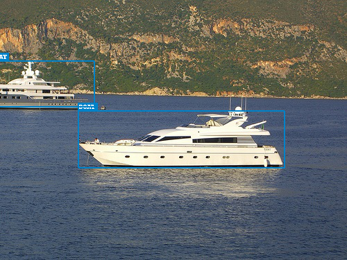
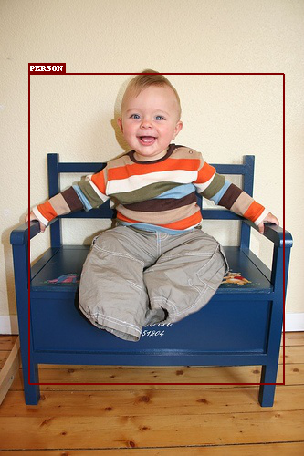
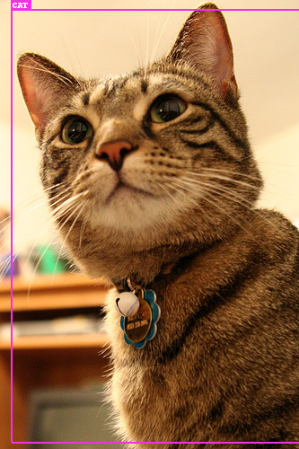
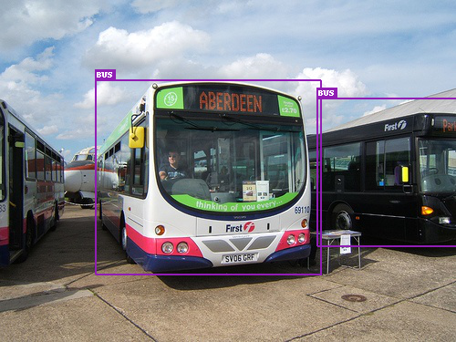
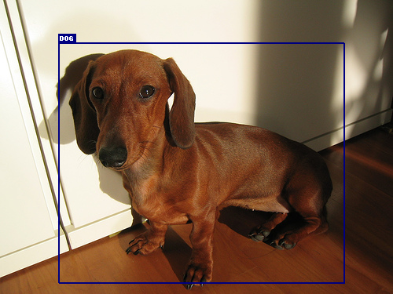
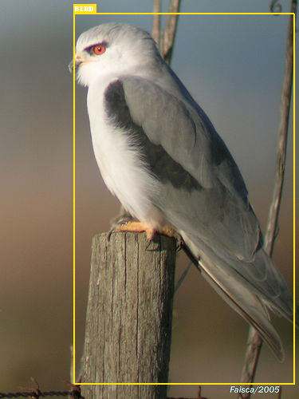

## Pelee: A Real-Time Object Detection System on Mobile Devices (in Pytorch)

Re-implementation of [Pelee: A Real-Time Object Detection System on Mobile Devices](https://arxiv.org/pdf/1804.06882.pdf) (NeurIPS 2018) in Pytorch that was originally implemented in [Caffe](https://github.com/Robert-JunWang/Pelee). 

### Prerequisite
Below are the list of dependencies:
- torch==1.6.0+cu101
- torchvision==0.7.0+cu101
- tqdm==4.50.0
- Pillow==7.2.0
- tensorboard==2.3.0

### Training, Evaluation, and Inference
Most of the training, and inference related code is adapted from this excellent [SSD tutorial](https://github.com/sgrvinod/a-PyTorch-Tutorial-to-Object-Detection). One can prepare VOC dataset by following the initial training step in SSD tutorial.

- To train run
```
python train.py
```
- To evaluate run
```
python eval.py
```
- To run inference run
```
python detect.py
```
#### Output
<p align="left">
 <br/><br/>
  <p />


### To visualize the model
If modifying for other resolution or adding layers into ```peleenet.py``` it is useful to visualize the tensor dimensions and the structure. One can use tensorboard for the same, to visualize the model run and open ```localhost:6007``` in the browser:
```
tensorboard --logdir ./logs/model_view/ --port 6007
```

### Results on VOC data

|  Class | Average Precision  |
| :---: | :---: |
|  _aeroplane_  | 0.7383095622062683 |
|   _bicycle_   | 0.7767311930656433 |
|    _bird_     | 0.5793640613555908 |
|    _boat_     | 0.571195125579834  |
|   _bottle_    | 0.3017434775829315 |
|     _bus_     | 0.787638783454895  |
|     _car_     | 0.7900775671005249 |
|     _cat_     | 0.7957690358161926 |
|    _chair_    | 0.4400455355644226 |
|     _cow_     | 0.6515666842460632 |
| _diningtable_ | 0.6680755615234375 |
|     _dog_     | 0.7375100255012512 |
|    _horse_    | 0.8111388087272644 |
|  _motorbike_  | 0.7812069058418274 |
|   _person_    | 0.699440598487854  |
| _pottedplant_ | 0.4045950472354889 |
|    _sheep_    | 0.6549926996231079 |
|    _sofa_     | 0.7469193339347839 |
|    _train_    | 0.7816516757011414 |
|  _tvmonitor_  | 0.6561071872711182 |


### Acknowledgements
This work mainly is adapted from below two work.
- [Pytorch object detection tutorial ](https://github.com/sgrvinod/a-PyTorch-Tutorial-to-Object-Detection) - It is one of the excellent tutorials that explains the working of the SSD (Object detector).
- [Pelee.Pytorch](https://github.com/yxlijun/Pelee.Pytorch) - This is also very useful prior work in reproducing the results of original caffe model. This repo also implements ```peleenet.py```, but it is different from our implementation. 


